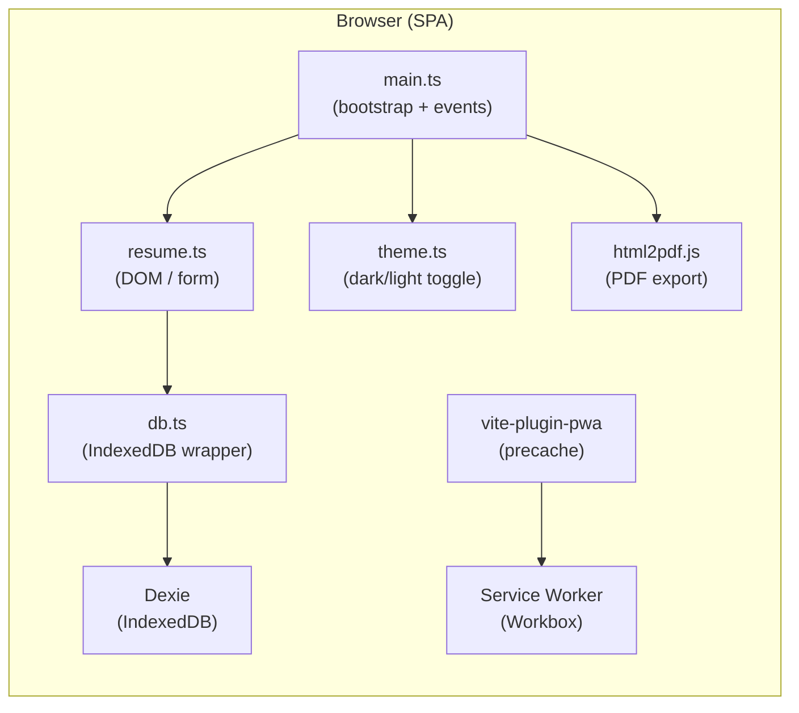
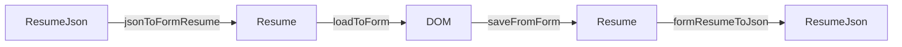
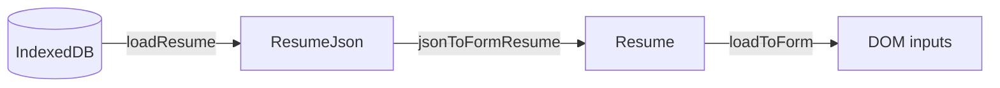
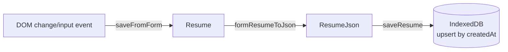
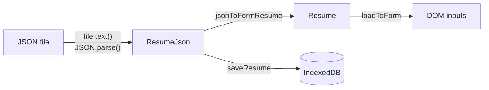

# ShigotoForm — Design Document

## Overview

ShigotoForm (シゴトフォーム) is a **fully client-side, offline-capable Progressive Web App (PWA)** for creating Japanese-style résumés (履歴書). All user data is stored locally in the browser's IndexedDB via Dexie and never leaves the device. There is no backend, no server communication, and no authentication.

---

## Tech Stack

| Category | Technology |
|---|---|
| Language | TypeScript 5.6 (strict mode, ES2020 modules) |
| Build tool | Vite 6 |
| UI framework | Bootstrap 5.3 |
| Persistence | Dexie 4 (IndexedDB wrapper) |
| PDF export | html2pdf.js 0.10 (html2canvas + jsPDF) |
| PWA / SW | vite-plugin-pwa + workbox-window |
| Fonts | Noto Sans JP, Noto Serif JP (via @fontsource, lazy-loaded) |
| Icons | Font Awesome 6 Free (lazy-loaded) |
| Furigana autocomplete | vanilla-autokana |
| Linter / Formatter | Biome |

---

## Architecture

The entire UI is injected into `#app` at startup by `main.ts`. There is no router; the app is a single view with Bootstrap modals for preview, help, and delete confirmation.

---

## Module Responsibilities

### `src/models/Resume.ts`
Core domain model. Defines the **internal form data types**:

- `Career` — one work/education entry (start, end, name, position, description)
- `License` — one licence/certification entry (date, name, pass)
- `Resume` — the complete form state (personal info + `Career[]` + `License[]`)
- `createEmptyResume()` — factory for a blank `Resume`

### `src/db.ts`
IndexedDB persistence layer. Defines the **storage/export schema**:

- `ResumeJson` — the canonical stored format. Nests career/license under `resume.{career,license}` alongside extra fields (`age`, `photo`, `address1Kana`, etc.). Also tolerates a legacy flat format (career/license at root level) for backwards-compatible imports.
- `ResumeRecord` — the Dexie table row (`id`, `createdAt`, `json: ResumeJson`)
- `ResumeDB extends Dexie` — DB class; schema version 4 with `createdAt` as primary key
- `saveResume(resume)` — upsert by `createdAt`
- `loadResume()` — returns the most recently created record
- `clearResume()` — deletes all records

### `src/resume.ts`
DOM rendering and form logic:

- `saveFromForm()` → reads every DOM input and returns a `Resume`
- `loadToForm(resume)` → writes a `Resume` into DOM inputs
- `generateResumeHtml(data, fontType)` → returns an A4 HTML string for the preview modal
- `addHistoryEventListener()` / `addLicenseEventListener()` — wire the "+" buttons for dynamic row creation
- `createCareerRow(item?)` / `createLicenseRow(item?)` — create a Bootstrap card DOM node for each row
- `attachCareerRowListeners(div)` / `attachLicenseRowListeners(div)` — attach change/input handlers that bubble `career-row-updated` / `license-row-updated` events

### `src/theme.ts`
Dark/light theme toggle. Reads `localStorage['theme']` on load and persists the user's choice. Applies `data-bs-theme` on `<body>` for Bootstrap 5 theming.

### `src/main.ts`
App entry point and orchestrator:

1. Injects the full HTML into `#app` (navbar, offcanvas menu, modals, form)
2. Wires all top-level event listeners (save, export, import, PDF download, delete, PWA update)
3. Provides the two conversion functions:
   - `jsonToFormResume(json: ResumeJson) → Resume` (load/import path)
   - `formResumeToJson(form: Resume) → ResumeJson` (save/export path)
4. Registers the Service Worker via `workbox-window` (manual update flow)
5. Lazy-loads Noto fonts and Font Awesome on idle / first interaction

---

## Data Models

### Two representations

| | `Resume` (internal) | `ResumeJson` (storage / export) |
|---|---|---|
| Defined in | `src/models/Resume.ts` | `src/db.ts` |
| Used by | `saveFromForm()`, `loadToForm()` | `saveResume()`, `loadResume()`, JSON export |
| Career location | `resume.career[]` (flat) | `resume.resume.career[]` (nested) |
| License location | `resume.license[]` (flat) | `resume.resume.license[]` (nested) |
| Extra fields | — | `age`, `photo`, `address1Kana`, `address2Kana`, `subject`, `condition`, `hobby`, `reason`, `expectations`, `education[]` |

The conversion between the two happens exclusively in `main.ts`:

### Backwards-compatible import

`jsonToFormResume()` checks both `json.resume.career` (current format) and the flat `json.career` (legacy format) so that résumés exported by older versions of the app can still be imported.

---

## Data Flow

### Page load / Auto-restore

### Auto-save on every change

`MutationObserver` is used on `#career-history` and `#license-history` to automatically attach save listeners to dynamically added rows.

### JSON export

### JSON import

---

## PDF Export

1. The preview modal calls `generateResumeHtml(data, fontType)` which renders an A4 `
` at exactly 210 mm × 297 mm.
2. The user clicks **履歴書PDFダウンロード**.
3. `html2pdf().set(opt).from(preview).save()` is called with high-resolution settings:
   - `html2canvas.scale: 3` (3× rendering for sharpness)
   - `html2canvas.dpi: 192`
   - Canvas dimensions match physical A4 at 96 dpi
   - `onclone` callback forces white background and black text on all table cells to avoid theme bleed-through
4. Output filename: `履歴書_{fullname}_{YYYYMMDD}.pdf`

---

## PWA / Service Worker

The app uses **vite-plugin-pwa** (Workbox GenerateSW strategy) for precaching and **workbox-window** for the client-side registration and manual update flow.

### Update flow
1. On registration, the SW precaches all build assets.
2. When a new SW version reaches the `waiting` state, `wb.addEventListener('waiting', …)` fires and sets `updateReady = true`, displaying "新しいバージョンがあります" in the menu.
3. The user clicks **アプリのアップデート**:
   - If `updateReady`, `wb.messageSkipWaiting()` is called immediately.
   - Otherwise, `wb.update()` checks for a new version.
4. On `controlling` event, the page reloads to apply the new SW.

In dev mode (`command === 'serve'`), `basicSsl()` and `type: 'module'` SW options are enabled for local HTTPS (required by the Service Worker API).

---

## Font Loading Strategy

Fonts are not loaded on initial paint to keep first-render fast.

| Font | Trigger |
|---|---|
| Noto Sans JP / Noto Serif JP | `requestIdleCallback` after `DOMContentLoaded` |
| Font Awesome | `pointerover` or `focusin` on the help button, or when the offcanvas menu opens |

After each font bundle loads, a CSS class is added to `<html>`:
- `fonts-loaded` — enables Noto font families for the form and preview
- `icons-loaded` — reveals Font Awesome icons (buttons show text fallback until then)

---

## Theme System

- Bootstrap 5 `data-bs-theme` attribute on `<body>` drives all component colours.
- The toggle switch (`#theme-switch`) in the offcanvas menu persists the choice to `localStorage['theme']`.
- `theme.ts` applies the stored theme on every page load before rendering begins.

---

## Key Constraints

- **No backend, no network requests for data.** Everything is IndexedDB.
- `tsconfig.json` enforces `strict`, `noUnusedLocals`, and `noUnusedParameters`.
- `dist/` is generated output — never commit manual changes to it.
- Do not import modules inside `index.html`; it only bootstraps `src/main.ts`.
- The `@ts-ignore` on `html2pdf.js` is intentional — no `@types` package exists.
- No ESLint/Prettier — Biome is used for linting and formatting.
